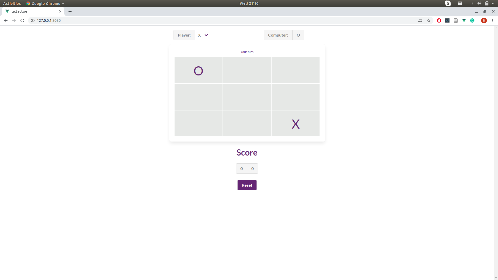

# tictactoe

Tic-tac-toe Artificial inteligence agent implementing minmax algorithm with an offline mobile-first frontend implemting ["of the main thread"](https://developer.chrome.com/devsummit/sessions/the-main-thread-is-overworked-and-underpaid/) architecture

## Screenshots
|

## Project setup
```
npm install
```

### Compiles and hot-reloads for development
```
npm run serve
```

### Compiles and minifies for production
```
npm run build
```

### Run your tests
```
npm run test
```

### Lints and fixes files
```
npm run lint
```

### Customize configuration
See [Configuration Reference](https://cli.vuejs.org/config/).
